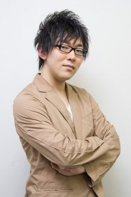
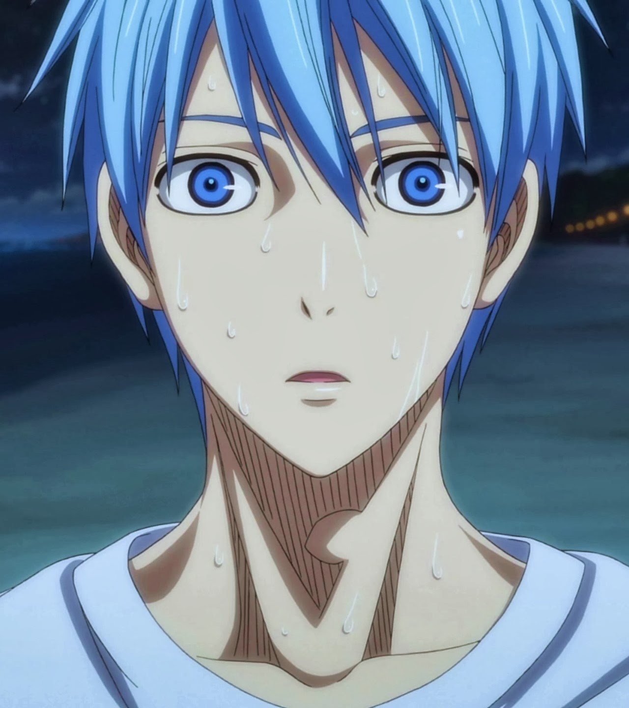
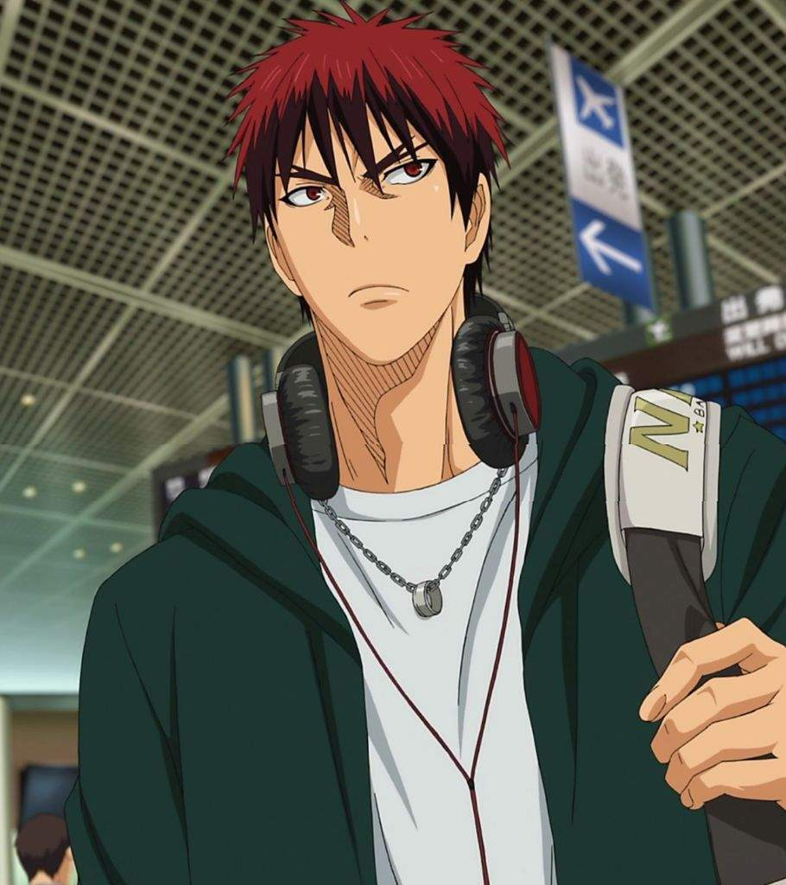
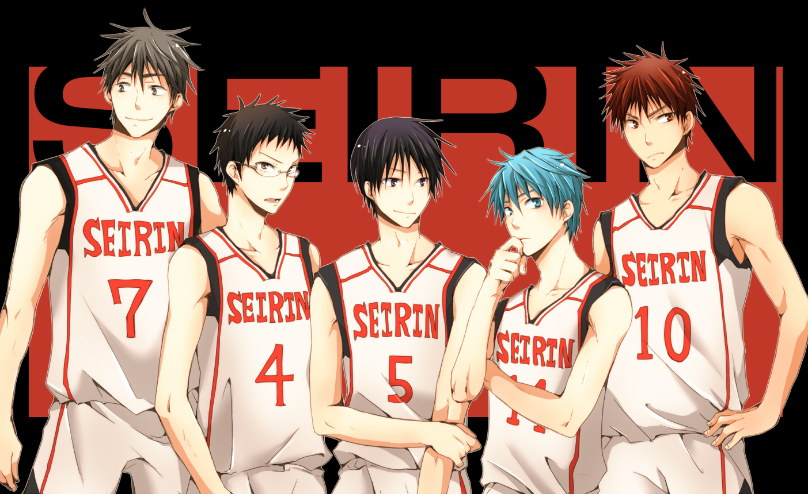
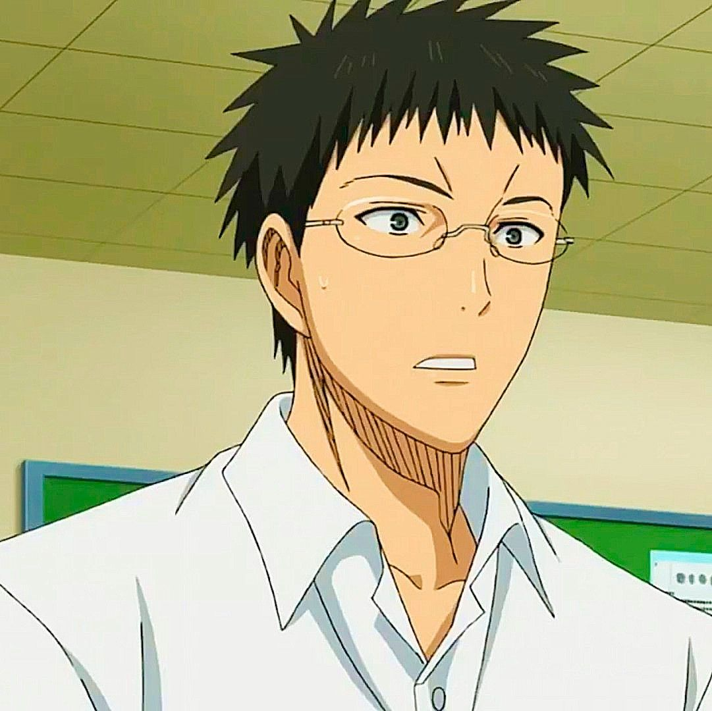
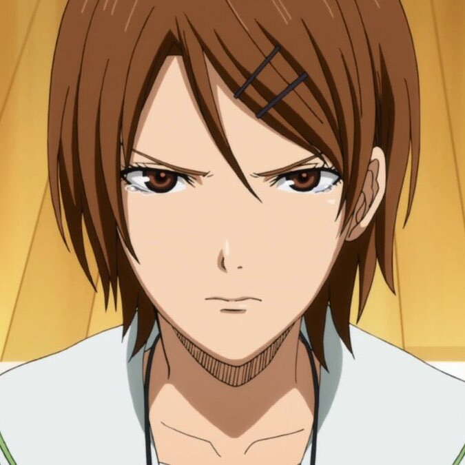
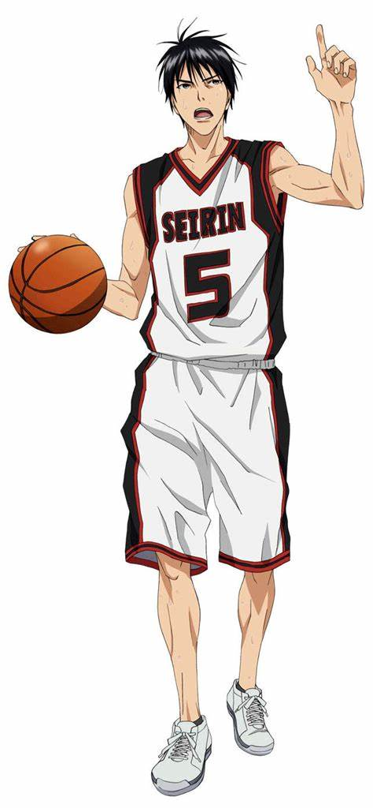
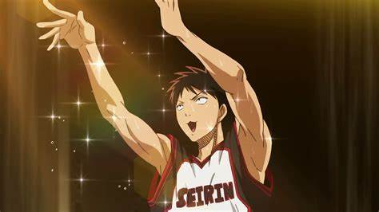
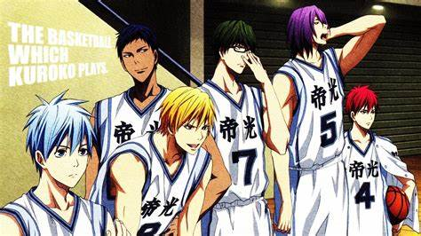

# Anime Series Kurokos Basketball

# Description

"Kuroko's Basketball," known as "Kuroko no Basuke" in Japanese, is a popular sports manga and anime series written and illustrated by Tadatoshi Fujimaki. It follows the journey of high school basketball teams in Japan, particularly the Seirin High School basketball team, as they strive to become the best in the country.

The series revolves around the unique dynamics of the Seirin team, which is led by the skilled and passionate player Taiga Kagami and the enigmatic and seemingly invisible player Tetsuya Kuroko. Kuroko, known as the "Phantom Sixth Man," possesses exceptional skills in passing and deception, making him a valuable asset despite his unassuming presence on the court. Together with Kagami and their teammates, they aim to take on some of the strongest teams in Japan, including their fierce rivals, the Generation of Miracles.

The "Generation of Miracles" refers to a group of exceptionally talented basketball players who attended Teikō Junior High School. Each member of this group possesses extraordinary skills, and their reunion on various high school teams becomes a central focus of the series. Kuroko, once a member of the Generation of Miracles himself, left the group to pursue his own path, seeking to prove that basketball is a team sport where individual talent isn't everything.

Throughout the series, there's a mix of intense basketball matches, character development, and themes of friendship, teamwork, and determination. The matches are often depicted with dynamic action sequences and strategic gameplay, showcasing the different playing styles and abilities of the characters.

"Kuroko's Basketball" has garnered a significant following both domestically in Japan and internationally, particularly among fans of sports anime and manga. Its popularity stems from its compelling characters, engaging storyline, and thrilling basketball matches, making it a beloved series in the genre.

# Author

The author of "Kuroko's Basketball" is Tadatoshi Fujimaki. He both wrote and illustrated the manga series. Fujimaki-sensei's work on "Kuroko's Basketball" has earned him widespread recognition and praise within the manga and anime community.

# Characters

"Kuroko's Basketball" features a diverse cast of characters, each with their own unique personalities, skills, and backgrounds. Here are some of the main characters:

1. Tetsuya Kuroko: The protagonist of the series, Kuroko is known as the "Phantom Sixth Man" due to his unassuming presence on the basketball court. He possesses exceptional passing and misdirection skills, making him a key player despite his lack of scoring ability.

   Tetsuya Kuroko's main ability in "Kuroko's Basketball" is his exceptional skill in misdirection and passing. Despite his unassuming appearance and lack of scoring ability, Kuroko possesses remarkable basketball talent that makes him a valuable asset to his team, Seirin High School.

Misdirection: Kuroko's signature ability is his mastery of misdirection. He has an uncanny knack for making himself seem invisible or unnoticeable on the basketball court, allowing him to pass and move without being tracked by opponents. This ability often catches opponents off guard, creating openings for his teammates to score.

Passing: Kuroko's passing skills are extraordinary. He can deliver precise and unexpected passes with incredible accuracy, setting up his teammates for scoring opportunities. His passes are often disguised or unexpected, making them difficult for opponents to intercept.

Defense: While Kuroko is primarily known for his offensive abilities, he is also a capable defender. His agility, quick reflexes, and understanding of opponents' movements allow him to disrupt their plays and steal the ball.

Teamwork: Kuroko's greatest strength lies in his ability to work seamlessly with his teammates. He understands the strengths and weaknesses of each player and knows how to maximize their potential on the court. His selflessness and dedication to teamwork make him an invaluable member of the Seirin basketball team.

Kuroko's unique skill set, particularly his misdirection and passing abilities, sets him apart as a player and contributes significantly to the success of his team in "Kuroko's Basketball."
  

2. Taiga Kagami: A talented and passionate basketball player who transfers to Seirin High School. Kagami has extraordinary athleticism and a fierce competitive spirit. He becomes Kuroko's teammate and forms a powerful duo with him.

   Athleticism: Kagami is known for his incredible physical prowess and athleticism. He has exceptional speed, agility, and vertical leap, allowing him to outmaneuver opponents, drive to the basket with power, and dominate rebounds.

Dunking: Kagami is particularly renowned for his dunking ability. He can execute powerful and acrobatic dunks with ease, often using his athleticism to soar above defenders and finish plays with authority.

Jumping Ability: Kagami's impressive vertical leap enables him to contest shots, block opponents' attempts, and grab rebounds at a high point. His athleticism and timing make him a formidable presence in the paint.

Defense: Kagami's athleticism also translates to the defensive end of the court. He has quick reflexes, strong defensive instincts, and the agility to stay in front of his opponents, making it difficult for them to score against him.

Scoring: While Kagami initially relies heavily on his physical abilities and scoring prowess, he gradually develops his basketball skills and becomes a more versatile scorer. He learns to use his strength and agility to create scoring opportunities for himself and his teammates.

Teamwork: Despite his individual talent, Kagami understands the importance of teamwork and collaboration on the basketball court. He learns to trust his teammates, particularly Tetsuya Kuroko, and becomes a key player in Seirin High School's efforts to win games and tournaments.

Taiga Kagami's combination of athleticism, scoring ability, defensive prowess, and teamwork make him a formidable force in "Kuroko's Basketball," contributing significantly to the success of the Seirin basketball team.

3. Seirin High School Team:
   

   
   - Junpei Hyuga: The captain of the Seirin basketball team. He is a skilled shooter and a reliable leader.

   - Riko Aida: The team's coach and manager. She is known for her analytical mind and strategic coaching.

   - Shun Izuki: A witty and perceptive player known for his ability to analyze opponents' movements and weaknesses.

   - Shinji Koganei: A versatile player with good court vision and passing skills.

   - Satoshi Tsuchida: A supportive and hardworking player who specializes in rebounds and defense.

   - Rinnosuke Mitobe: A quiet and reserved player with exceptional strength and defensive skills.

4. Generation of Miracles:
   

   - Daiki Aomine: Known as the "Ace" of the Generation of Miracles, Aomine is an exceptionally talented player with incredible speed and scoring ability.
   - Ryota Kise: A model-like player with the ability to copy and mimic the moves of other players. He is known for his versatility and charisma.
   - Shintaro Midorima: A superstitious player who excels in long-range shooting. He carries a lucky item with him at all times and has remarkable accuracy from anywhere on the court.
   - Atsushi Murasakibara: A towering center with immense strength and natural talent. He is known for his dominance in the paint and lazy demeanor.
   - Seijuro Akashi: The former captain of the Generation of Miracles and the current captain of Rakuzan High School. Akashi is a master strategist and possesses incredible leadership skills, as well as a unique ability to enter a state called the "Zone."

These are just a few of the many characters that populate the world of "Kuroko's Basketball," each contributing to the rich tapestry of the story with their own motivations, struggles, and triumphs.

